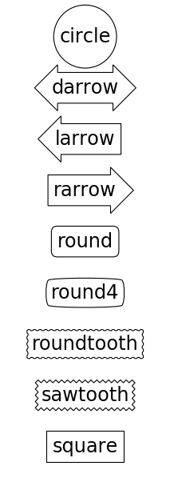
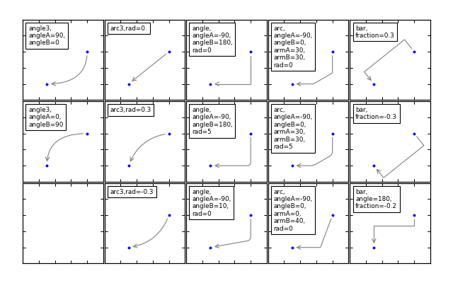
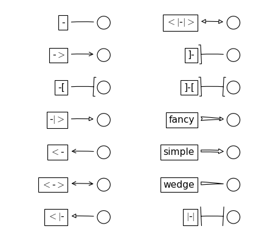
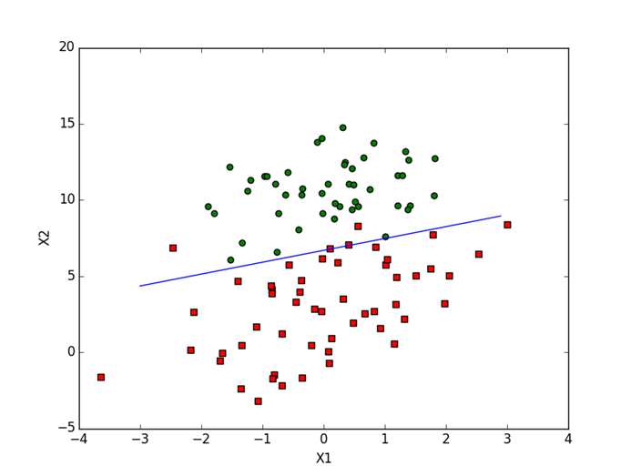
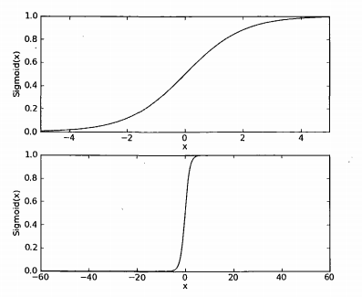
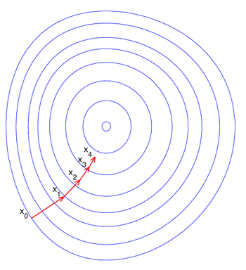

机器学习基础
============

1.  概念：何为机器学习，将无序的数据转换成有用的信息
2.  数据获取：譬如可以在人们手机上装app，通过许多手机的磁力计得到信息
3.  术语：
    -   专家系统
    -   属性/特征
    -   分类
    -   目标变量(类别)
    -   训练数据和测试数据

4.  任务：
    1.  监督学习(知道预测什么，即目标变量的分类信息)
        -   分类：将实例数据划分到合适的分类中，譬如数据拟合曲线
        -   回归：主要用于预测数值型数据

    2.  无监督学习(数据无类别信息，不给目标值)
        -   聚类：数据集合分成类似对象组成的集合
        -   密度估计：寻找数据统计值的过程
        -   无监督学习还可以减少数据特征的维度，以便我们可以使用二维或三维图形展示数据

5.  开发步骤
    1.  收集数据
    2.  准备输入数据
    3.  分析输入数据
    4.  训练算法
    5.  测试算法
    6.  使用算法

k-近邻算法(kNN)
===============

概述
----

-   简单而言，k-近邻算法采用测量不同特征值之间的距离方法进行分类
-   工作原理：
    1.  存在一个样本数据集合(训练样本集)，其中每个数据存在标签
    2.  输入没有标签的新数据后，将新数据的每个特征与样本集中数据对应的特征进行比较
    3.  算法提取样本集中数据中最相似(最相邻)的分类标签，一般而言，我们只选择样本数据前k个最相似数据
    4.  k即为k-近邻算法中k的出处，一般k取值不大于20

示例
----

### 场景一

收集到约会数据，保存在 'datingTestSet.txt'
中，每个样本数据占据一行，总共有1000行。
样本包含以下3种特征以及1种label：

-   每年获得的飞行常客里程数
-   玩视频游戏所耗时间百分比
-   每周消费冰淇淋公升数
-   label分为三种：很喜欢，一般喜欢，不喜欢

#### 考虑

1.  算法采用 k 近邻算法
2.  label可以依次用数字1,2,3代表很喜欢，一般喜欢以及不喜欢，假设这样的数据文件变为了
    'datingTestSet2.txt'
3.  数据样本的前10%可以作为测试样本，剩余样本可以作为训练样本

#### 实现

1.  将数据读入，保存为一个 `array` 待用

    ``` {.python}
      from numpy import *

      def file2matrix(filename):
          fr = open(filename)
          arrayOLines = fr.readlines()
          m = len(arrayOLines)
          returnMat = zeros((m,3))
          classLabelVector = []
          index = 0
          for line in arrayOLines:
              line = line.strip()
              listFromLines = line.split('\t')
              returnMat[index,:] = listFromLines[0:3]
              classLabelVector.append(int(listFromLines[-1]))
              index += 1
          return returnMat, classLabelVector
    ```

2.  三种数据的数值范围差别过大，会导致对label的影响不一致，因此，需要对三种数据进行归一化

    ``` {.python}
      from numpy import *

      def autoNorm(dataSet):
          minVals = dataSet.min(0)
          maxVals = dataSet.max(0)
          ranges = maxVals - minVals
          dataSetSize = dataSet.shape[0]
          dataSet = dataSet - tile(minVals, (dataSetSize,1))
          normDataSet = dataSet/tile(ranges, (dataSetSize,1))
          return normDataSet, ranges, minVals
    ```

3.  算法实现

    ``` {.python}
      from numpy import *
      import operator

      def classify0(inX, dataSet, labels, k):
          # 计算距离
          m = dataSet.shape[0]
          diffMat = tile(inX, (m, 1)) - dataSet
          sqDiffMat = diffMat**2
          sqDistances = sqDiffMat.sum(axis=1)
          distances = sqDistances**0.5
          # 将距离进行排序
          # argsort() 函数，可以将 array 中的数值，按从小到大编号
          sortedDistIndices = distances.argsort()
          classCount = {}
          for i in range(k):
              # 前k个离测试点最近的label
              voteIlabel = labels[sortedDistIndices[i]]
              classCount[voteIlabel] = classCount.get(voteIlabel, 0) + 1
          sortedClassCount = sorted(classCount.items(), key=operator.itemgetter(1), reverse=True)
          return sortedClassCount[0][0]
    ```

4.  进行测试

    ``` {.python}
      from numpy import *

      def datingClassTest():
          # 前10%作为测试样本
          hoRatio = 0.1

          # 导入数据并归一
          dataFile = '/home/curiousbull/Workspace/Python/machinelearninginaction/Ch02/datingTestSet2.txt'
          datingDataMat, datingLabels = file2matrix(dataFile)
          normMat, ranges, minVals = autoNorm(datingDataMat)

          m = normMat.shape[0]
          numTestVecs = int(m*hoRatio)
          errorCount = 0.0
          for i in range(numTestVecs):
              classifierResult = classify0(normMat[i,:], normMat[numTestVecs:m,:], \
              datingLabels[numTestVecs:m], 3)
              print("the classifier came back with: %d, the real answer is: %d" %(classifierResult, datingLabels[i]))
              if(classifierResult != datingLabels[i]): errorCount += 1.0
          print("the total error rate is: %f" %(errorCount/float(numTestVecs)))
    ```

### 场景二

目录digits下，分别有两个目录，testDigits和trainingDigits，代表用于测试的数据和训练的数据，
样本名包含需要识别的数字，也就是label，样本中是需要识别的手写数字数据集，每个单独文件都是32x32
的矩阵形式，包含 0 和 1

#### 考虑

1.  使用 k 近邻算法
2.  将文件名进行分割，得到对应的 labels 向量
3.  将每个文件内的32x32的0,1数字存储到一个vector，也就是一个1x1024的向量，作为识别的输入

#### 实现

1.  得到labels向量

    ``` {.python}
      from numpy import *
      from os import listdir

      def file2labels(dirName):
          trainingFileList = listdir(dirName)
          numberOfFiles = len(trainingFileList)
          hwLabels = []
          for i in range(numberOfFiles):
              strTrainingFiles = trainingFileList[i].split('.')[0]
              hwLabels.append(int(strTrainingFiles.split('_')[0]))
              trainingFileList[i] = dirName + trainingFileList[i]
          return hwLabels, trainingFileList
    ```

2.  将img(32x32矩阵)转换为1x1024向量形式

    ``` {.python}
      from numpy import *
      from os import listdir

      def img2vec(filename):
          fr = open(filename)
          vecImg = zeros((1,1024))
          for row in range(32):
              strLine = fr.readline()
              for col in range(32):
                  vecImg[0, 32*row+col] = int(strLine[col])
          return vecImg
    ```

3.  实现kNN算法

    ``` {.python}
      from numpy import *
      from os import listdir
      import operator

      def classify0(inX, dataSet, labels, k):
          dataSetSize = dataSet.shape[0]
          diffMat = tile(inX, (dataSetSize, 1))-dataSet
          sqDiffMat = diffMat**2
          sqDistances = sqDiffMat.sum(axis=1)
          distances = sqDistances**0.5
          sortedDistIndicies = distances.argsort()
          countLabels = {}
          errorCount = 0.0
          for i in range(k):
              voteIlabel = labels[sortedDistIndicies[i]]
              countLabels[voteIlabel] = countLabels.get(voteIlabel, 0) + 1
          sortedCountLabels = sorted(countLabels.items(), key=operator.itemgetter(1),\
                                     reverse=True)
          return sortedCountLabels[0][0]
    ```

4.  测试样本

    ``` {.python}
      def hwTest():
          testDirName = 'digits/testDigits/'
          trainingDirName = 'digits/trainingDigits/'
          hwLabels, trainingFiles = file2labels(trainingDirName)
          numberOfTrainingFiles = len(trainingFiles)
          trainingDataSet = zeros((numberOfTrainingFiles, 1024))
          for i in range(numberOfTrainingFiles):
              trainingDataSet[i,:] = img2vec(trainingFiles[i])
          testHwLabels, testFiles = file2labels(testDirName)
          numberOfTestFiles = len(testFiles)
          errorCount = 0.0
          for i in range(numberOfTestFiles):
              testVec = img2vec(testFiles[i])
              classifierLabel = classify0(testVec, trainingDataSet, hwLabels, 3)
              print("the classifer come back to: %d while the true value is: %d"\
              %(classifierLabel, testHwLabels[i]))
              if(classifierLabel != testHwLabels[i]): errorCount += 1.0
          print("the total error classifiers number is: %f" %(errorCount/float(numberOfTestFiles)))
          print("the error rate is: %f" %(errorCount/float(numberOfTestFiles)))
    ```

#### 注意点

1.  要使用 `listdir()` 函数，需要从 `os` 模块导入，但是不要将 `os`
    模块中将所有内容都导入，以下代码

    ``` {.python}
      from os import *
    ```

    会导致 `open()` 函数不可用
2.  注意 'labels' 从字符串中导入时，将字符串强转为 `int` 型

决策树
======

概述
----

#### 定义

决策树的分类思想类似姑娘找对象，相亲前，通过类似年龄、长相、收入，职业等将男人分为见或不见两类。类似下图：
 从上图，可以总结出决策树的定义，即：
决策树（decision tree）是一个树结构（可以是二叉树或非二叉树）。其
每个非叶节点表示一个特征属性上的测试，每个分支代表这个特征属性在某个值域上的输出，而每个叶节点存放一个类别。
使用决策树进行决策的过程就是从根节点开始，测试待分类项中相应的特征属性，并按照其值选择输出分支，直到到达叶
子节点，将叶子节点存放的类别作为决策结果。

#### 构造

关键步骤在于分裂属性，即在某个节点处按照某一特征属性的不同划分构造不同的分支，目标是让各个分裂子集尽可能地
“纯”，即可能纯就是尽量让一个分裂子集中待分类项属于同一类别。分裂属性分三种情况：

1.  属性离散且不要求生成二叉树，此时用属性的每一个划分作为一个分支
2.  属性离散且要求生成二叉树，此时使用属性划分的一个子集作为测试，以“属于子集”和“不属于子集”分成两个分支
3.  属性值连续，确定一个值作为分裂点(split-point)，以 &lt;split-point
    和 &gt;split-point 生成两个分支

#### `ID3` 算法(仅对于属性离散且不要求生成二叉树的情况讨论)

如果待分类的事物可能划分在多个分类中，譬如，设D为用类别对训练元组进行的划分

1.  符号 $x_i$ 信息的定义：

    ``` {.latex}
      \begin{equation}
        l(x_i) = -\log_{2}p(x_i)
      \end{equation}
    ```

    其中\$p~(x~i~)~\$表示第i个类别在整个训练元组出现的概率
2.  D的熵(entropy)定义

    ``` {.latex}
      \begin{equation}
        info(D) = -\sum^n_{i=1}p(x_i)\log_{2}p(x_i)
      \end{equation}
    ```

    熵的实际意义表示D中元组的类标号所需要的平均信息量。
3.  假设训练元组D按属性A划分，则该划分的熵计算如下：

    ``` {.latex}
      \begin{equation}
        info_A(D)=\sum^{\nu}_{j=1}\frac{D_i}{D}info(D_j)
      \end{equation}
    ```

4.  将D按属性A划分后，信息增益为两者的差值

    ``` {.latex}
      \begin{equation}
        gain(A) = info(D) - info_A(D)
      \end{equation}
    ```

5.  将D按所有属性进行划分，计算各种划分的信息增益，选择增益最大的属性进行划分，之后递归至
    -   划分后的所有分支内的元素都属于同一类别
    -   可用于划分的属性已使用完

示例
----

### 场景

有数据文件
'lenses.txt'，其中包含了如何预测患者需要佩戴的隐形眼镜类型数据。分为5列，
前四列为特征属性，最后一列为隐形眼镜的类型，也就是我们的 labels
特征依次为 '年龄(age)' '处方(prescript)' '是否散光(astigmatic)'
'眼泪多少(tearRate)'

#### 考虑

1.  使用算法决策树解决问题
2.  数据导入(`createDataSet()`)，返回数据(dataSet)和标签(labels)
3.  数据分割(`splitDataSet()`)：按特征属性划分数据的时候，需要处理的数据(dataSet)是对应
    该特征值的某个值的子dataSet
4.  考虑能够得到最大信息增益的特征，因此需要计算不同分割方法的熵(entropy)
5.  算法实现(`createTree()`)：利用递归的方法，终止条件有两种：
    1.  按照当前特征划分的分支内所有元素都是同一类，即标签相同
    2.  用于划分的特征属性已经用完

6.  对应用于划分数据的特征属性用完后，如果某个分支内还有不同标签，处理方法可以效仿
    `KNN` 算法，取该分支内占最多的label作为该分支的label
7.  测试

#### 实现

1.  数据导入 定义 `createDataSet()` 函数，返回 `dataSet` 和 `labels`
    待用

    ``` {.python}
      def createDataSet(filename):
          fr = open(filename)
          dataSet = [inst.strip().split('\t') for inst in fr.readlines()]
          labels = ['age', 'prescript', 'astigmatic', 'tearRate']
          return dataSet, labels
    ```

2.  数据分割 需要将数据中用于划分的列刨除

    ``` {.python}
      def splitDataSet(dataSet, axis, value):
          retDataSet = []
          # 逐行输入
          for featVec in dataSet:
              if featVec[axis] == value:
                  reducedVec = featVec[0:axis]
                  reducedVec.extend(featVec[axis+1:])
                  retDataSet.append(reducedVec)
          return retDataSet
    ```

3.  熵计算 对输入的dataSet，统计其所有事例数，统计不同label统计事例数
    不同label统计事例数/总事例数=该label对应概率

    ``` {.python}
      from math import log

      def calcShannonEnt(dataSet):
          numEntries = len(dataSet)
          labelCount = {}
          for featVec in dataSet:
              currentLabel = featVec[-1]
              labelCount[currentLabel] = labelCount.get(currentLabel, 0)+1
          info = 0.0
          for keys in labelCount.keys():
              prob = float(labelCount[keys])/numEntries
              info -= prob*log(prob, 2)
          return info
    ```

4.  挑选最佳分割路线，即确定最大信息增益的分割方式

    ``` {.python}
      def chooseBestFeatToSplit(dataSet):
          # 可用分割的特征数
          numFeat = len(dataSet[0]) - 1

          # 原始熵值
          baseEntropy = calcShannonEnt(dataSet)

          # 遍历可用特征，计算得到最大增益和与之匹配的特征编号
          maxInfoGain = 0.0; bestFeat = -1
          for i in range(numFeat):
              featList = [example[i] for example in dataSet]
              uniqueVals = set(featList)
              newEntropy = 0.0
              for value in uniqueVals:
                  subDataSet = splitDataSet(dataSet, i, value)
                  prob = len(subDataSet)/float(len(dataSet))
                  newEntropy += prob*calcShannonEnt(subDataSet)
              infoGain = baseEntropy - newEntropy
              if infoGain > maxInfoGain:
                  maxInfoGain = infoGain
                  bestFeat = i

          # 返回最大信息增益对应的特征编号
          return bestFeat
    ```

5.  算法实现
    利用熵计算，得到最佳的按特征分割方式，终止条件分为两种，如果是第二种终止条件，对该分支内
    的元素采取类似kNN的做法，取多数的label作为该分支label
    1.  终止条件如果是用于分割数据的特征用完，需要定义一个处理分支内元素有不同label情况的函数

        ``` {.python}
          def majCnt(classList):
              classCount = {}
              for vote in classList:
                  classCount[vote] = classCount.get(vote, 0) + 1
              # 注意，此处sortedLabelCount是一个tuple
              sortedLabelCount = sorted(labelCount.items(), key=operator.itemgetter(1), reverse=True)
              return sortedLabelCount[0][0]
        ```

    2.  利用递归实现 `createTree()` 方法，利用包含 `dict` 的 `dict`
        的形式来存放 `tree`

        ``` {.python}
          def createTree(dataSet, labels):
              # 首先应该考虑传入的数据是否还需要分割
              # 获取数据集中所有标签
              classList = [example[-1] for example in dataSet]
              # 1. 分支内所有元素标签相同
              if classList.count(classList[0]) == len(dataSet):
                  return dataSet

              # 2. 所有可用分割特征使用结束
              if len(dataSet[0]) == 1:
                  majCnt(classList)

              # 以上终止条件不满足，对dataSet进行划分

              # 最佳分割特征对应编号
              bestFeat = chooseBestFeatToSplit(dataSet)
              bestFeatLabel = labels[bestFeat]

              # 利用特征定义树
              myTree = {bestFeatLabel:{}}

              # 将labels中此次最佳分割特征去除，在剩余特征中重新选择分割特征
              del(labels[bestFeat])

              # 该特征对应取值
              featValues = [example[bestFeat] for example in dataSet]
              uniqueValues = set(featValues)

              # 按特征属性值进行分割
              for value in uniqueValues:
                  subLabels = labels[:] # 尤其注意这句话的含义？
                  myTree[bestFeatLabel][value] = createTree(splitDataSet(dataSet, bestFeat, value), subLabels)

              # 返回树
              return myTree
        ```

使用 `matplotlib` 画树图
------------------------

### 关于注释

#### 注释文字 (`Annotation Text`)

`text()` 函数可以设置在哪个位置坐标系任意位置添加文本。 而 `annotate()`
函数可以在添加文本 的基础上，提供更多丰富的功能，使得添加注释更加容易。
在注释中，最重要的是两个参数，一个是参数
'xy'，它代表需要被注释的点所在位置；另一个参数是
'xytext'，代表注释文本所在位置。

``` {.python}
  import numpy as np
  import matplotlib.pyplot as plt

  fig = plt.figure()
  ax = fig.add_subplot(111)

  t = np.arange(0.0, 5.0, 0.01)
  s = np.cos(2*np.pi*t)
  line, = ax.plot(t, s, lw=2)

  ax.annotate('local max', xy=(2, 1), xytext=(3, 1.5),
              arrowprops=dict(facecolor='black', shrink=0.05),
              )

  ax.set_ylim(-2,2)
  plt.show()
```

上述代码会产生如下图所示效果： 

#### 坐标系 (`coordinate system`)

在上述代码中， `annotate()` 函数没有指定坐标系，默认 'xy' 'xytext'
所代表的位置为数据坐标系，
实际应用中，我们可以按需求任意指定坐标系，可用的坐标系可见下表：

  argument            coordinate system
  ------------------- ----------------------------------------------------
  'figure points'     points from the lower left corner of the figure
  'figure pixels'     pixels from the lower left corner of the figure
  'figure fraction'   0,0 is lower left of figure and 1,1 is upper right
  'axes points'       points from lower left corner of axes
  'axes pixels'       pixels from lower left corner of axes
  'axes fraction'     0,0 is lower left of axes and 1,1 is upper right
  'data'              use the axes data coordinate system

譬如， 注释位置用 'fractional axes’ coordinates，可以

``` {.python}
  ax.annotate('local max', xy=(3,1), xycoords='data', xytext=(0.8, 0.95),\
              textcoords='axes fraction', arrowprops=dict(facecolor='black', shrink=0.05),\
              horizontalalignment='right',verticalalignment='top')
```

#### 箭头性质 (`arrow properties`)

箭头性质也可以用下表的参数进行指定

  arrowprops key   description
  ---------------- ---------------------------------------------------------------------------
  width            the width of the arrow in points
  frac             the fraction of the arrow length occupied by the head
  headwidth        the width of the base of the arrow head in points
  shrink           move the tip and base some percent away from the annotated point and text
  \*\*kwargs       any key for matplotlib.patches.Polygon, e.g., facecolor

#### 线条性质

最简单方式，利用以下代码查看可用线条性质设置

``` {.python}
  lines = plt.plot([1,2,3])
  plt.setp(lines)
```

#### 注释轴 (`Annotation Axes`)

##### Annotating with Text with Box

`text()` 会接受 'bbox' 关键词参数，当接受到 'bbox'
参数时，注释文字会被一个 'box' 包围

``` {.python}
  bbox_props = dict(boxstyle='rarrow, pad=0.3', fc='cyan', ec='b', lw=2)
  t = ax.text(0, 0, "Direction", ha='center', va='center', rotation=45, size =15,\
              bbox=bbox_props,)
```

下表是 'box' 可接受的参数与属性值

  Class        Name         Attrs
  ------------ ------------ -----------------------------
  Circle       circle       pad=0.3
  DArrow       darrow       pad=0.3
  LArrow       larrow       pad=0.3
  RArrow       rarrow       pad=0.3
  Round        round        pad=0.3
  Round4       round4       pad=0.3,rounding~size~=None
  Roundtooth   roundtooth   pad=0.3,tooth~size~=None
  Sawtooth     sawtooth     pad=0.3,tooth~size~=None
  Square       square       pad=0.3

与上表对应的图如下： 

##### Anonotating with Arrow

`annotate()` 函数在 `pyplot` 中是用来连接两个点的 (注释点与被注释点)。
画 'arrow' 主要分为以下几步：

1.  确定两点之间的连接路径，可以通过 `connectionsytle` 来控制
2.  假如 'patch object' (画块) 给定 (patchA &
    patchB)，路径会被裁剪，避开画块
3.  路径按照给定的 'pixels' 数值进行 'shrunk'
4.  路径变形为箭头状，通过 `arrowstyle` 控制属性

以上步骤总结在下图中：  注意：

1.  `connectionstyle` 可用的选项如下表：

      name     Attrs
      -------- ---------------------------------------------------
      angle    angleA=90, angleB=0, rad=0.0
      angle3   angleA=90, angleB=0
      arc      angleA=0, angleB=0, armA=None, armB=None, rad=0.0
      arc3     rad=0.0
      bar      armA=0.0,armB=0.0,fraction=0.3,angle=None

    其中 'angle3' 和 'arc3' 中的 3
    表示其指定的路径样式为二次样条线段，有 3
    个控制点，上述格式对应下图： 
2.  `arrowstyle` 可用选项如下：

      Name          Attrs
      ------------- ----------------------------------------------------
      -             None
      -&gt;         head~length~=0.4,head~width~=0.2
      -\[           widthB=1.0, lengthB=0.2, angleB=None
      |-|           widthA=1.0, widthB=1.0
      -|&gt;        head~length~=0.4, head~width~=0.2
      &lt;-         head~length~=0.4, head~width~=0.2
      &lt;-&gt;     head~length~=0.4, head~width~=0.2
      &lt;|-        head~length~=0.4, head~width~=0.2
      &lt;|-|&gt;   head~length~=0.4, head~width~=0.2
      fancy         head~length~=0.4, head~width~=0.4, tail~width~=0.4
      simple        head~length~=0.5, head~width~=0.5, tail~width~=0.2
      wedge         tail~width~=0.3, shrink~factor~=0.5

    具体样式见下图：  有些 `arrowstyle`
    仅与能生成二次样条线段的 `connectionstyle` 配合，这些 `arrowstyle`
    是 'fancy', 'simple', 'wedge'

### 树节点构造

终止块(叶节点)使用 `boxstyle=round4` 决策节点用 `boxstyle=sawtooth`

``` {.python}
  import matplotlib.pyplot as plt

  # 决策节点样式
  decisionNode = dict(boxstyle='sawtooth', fc='0.8')

  # 叶节点
  leafNode = dict(boxstyle='round4', fc=0.8)

  # arrow样式
  arrow_args = dict(arrowstyle='<-')

  def plotNode(nodeTxt, centerPt, parentPt, nodeType):
      createPlot.ax1.annotate(nodeTxt, xy=parentPt, xycoords='axes fraction',\
                              xytext=centerPt, textcoords='axes fraction',\
                              va='center', ha='center', bbox=nodeType, arrowprops=arrow_args)

  def createPlot():
      fig = plt.figure(1, facecolor='white')
      fig.clf()
      createPlot.ax1 = plt.subplot(111, frameon=False)
      plotNode(U'决策节点', (0.5， 0.1), (0.1, 0.5), decisionNode)
      plotNode(U'叶节点', (0.8， 0.1), (0.3, 0.5), leafNode)
```

基于概率论的分类方法：朴素贝叶斯
================================

概述
----

### 概念

事物有许多属性，譬如一个事物 \$X\$，可以定义其一系列属性

``` {.latex}
  \begin{equation}
   $X = (x_1, x_2, x_3, \ldots)$
  \end{equation}
```

作为其描述，而不同事物可能归属不同种类，可以用集合 $Y$
作为各种不同种类的描述，

``` {.latex}
  \begin{equation}
  Y = y_1, y_2, \ldots, y_m
  \end{equation}
```

当给出任意一个事物 $X^{\prime}$
的时候，我们需要预测这个事物到底属于哪个种类 \$y^′^\$。
朴素贝叶斯理论做了一个假设，认为任意一个实例不同属性之间相互独立，这样，可以计算一个实例，其处于
不同种类之间的概率，选择概率最大的一个种类作为该实例种类的预测。如果定义
$P(y_i|X)$ 作为 $y_i$ 的 后验概率，表示实例 $X$ 属于种类 $y_i$ 的概率，
$P(y_i)$ 称为 $y_i$ 的先验概率， 通过计算不同 $y_i$
的后验概率，其中数值最大对应 $y_i$ 可以作为 $X$ 种类的预测。

实际我们可以直接得到的，一般是 $X$ 的后验概率 $P(X|y_i)$ (相当于 $X$
的属性出现在 $y_i$ 类的概率总和) 和 $P(y_i)$
的先验概率，但是，通过贝叶斯公式，我们可以求得 $X$ 的先验概率：

``` {.latex}
  \begin{equation}
  P(y_i|X) = \frac{P(X|y_i)P(y_i)}{P(X)}
  \end{equation}
```

### 特点

-   优点：数据较少的情况下仍然有效，可以处理多类别问题
-   缺点：对于输入数据的准备方式较为敏感
-   适用数据类型：标称型数据

### 举例说明

#### 说明

考虑一个医疗诊断问题，有两种可能假设： 1). 病人有癌症 2).
病人没癌症。样本数据来自某化验测试，测试结果有两种 1). 阳性 2). 阴性。
假如我们已经知道了普通人中只有 0.008
的人会患病。此外，化验结果对有病的患者有 98% 的可
能返回阳性结果，对无病患者有 97%
概率返回阴性结果。此时，有一个病人化验测试结果时阳性，是否可以将病人诊断为得了
癌症。

#### 考虑

``` {.latex}
  \begin{alignat}{2}
   \P(canser) &= 0.008  &\quad P(no canser) &= 0.992 \\  
   \P(positive|canser) &= 0.98  &\quad P(negative|canser) &= 0.02 \\  
   \P(positive|no canser) &= 0.03  &\quad P(negative|no canser) &= 0.97  
  \end{alignat}
```

这样，通过贝叶斯公式，我们可以求得该病人测试结果为阳性时，其得癌与不得癌的概率：

``` {.latex}
  \begin{eqnarray}
    P(canser|positive) &=& \frac{P(positive|canser)P(canser)}{P(positive)}\\\nolinenumber
    {} & = & \frac{0.98\times{}0.008}{P(positive)}\\\nolinenumber
    {} & = & \frac{0.0078}{P(positive)}\\
    P(no canser|positive) & = & \frac{P(positive|no canser)P(no canser)}{P(positive)}\\\nolinenumber
    {} & = & \frac{0.03\times{}0.992}{P(positive)}\\\nolinenumber
    {} & = & \frac{0.0298}{P(positive)}
  \end{eqnarray}
```

可以看出，该患者不得癌的概率更大，按照朴素贝叶斯的方法，我们认为其没有癌症。除此之外，我们还可以看出，我们不需要关系贝叶斯
公式的分母部分，只需要考察分子部分大小即可。

示例
----

### 场景一 利用朴素贝叶斯方法过滤垃圾邮件

数据集包含50封邮件，其中25封为垃圾邮件，随机将数据集切分为训练集(40封)和测试集(10封)。邮件目录为
'email'，下面又分为两个目录，分别为 'ham' 和
'spam'，存放普通邮件与垃圾邮件。

#### 考虑

1.  实例与类别的考虑：实例是邮件，类别是 'spam' 和 'ham'
    -   一个邮件相当于一个实例，其由一个个单词组成，因此，可以考虑用单词作为其属性的表述
    -   很多邮件的单词会有重叠，用所有英文单词作为属性去描述邮件，工作量太大，因此，可以考虑将用于训练的邮件中
        所有不重复的单词作成一个词汇表，词汇表中的单词作为不同邮件的描述
    -   一个词汇表相当于 \$(x~1~, x~2~, …,
        x~m~)\$，一个邮件相当于一个实例，实例对应的属性(词汇表中的单词)值
        就是词汇表中不同单词出现的次数，譬如：

        ``` {.example}
          vocabList = ['hello', 'world', 'sun', 'moon', 'good'] # 5 个属性
          docWordList1 = ['ni', 'hao', 'sun', 'is', 'big', 'world', 'good', 'world']
          docWordList2 = ['hello', 'beautiful', 'girl']
          docWordList1 -- vectorize --> [0, 2, 1, 0, 1] # 用 5 个属性表述结果
          docWordList2 -- vectorize --> [1, 0, 0, 0, 0] # 用 5 个属性表述结果
        ```

2.  词汇表的创建分为两步：
    1.  文档的分割，变成 '词汇'(words) 的组合
    2.  所有文档的词汇组合，创建词汇表

3.  实例的表述
    1.  初始化一个长度等于 'vocabList' 的 'vector'
    2.  对应每个属性，输入实例的属性值

4.  算法实现
    1.  输入参数为训练集(所有文档表述组合成的matrix)和labels
    2.  计算每个属性对应的先验概率 $P(x_i|y_i)$

#### 实现

1.  词汇表创立与文档描述
    1.  文档分割

        ``` {.python}
          import re

          def loadEmailFile(filename):
              fr = open(filename)

              # 分割邮件为单词的组合，去除空格与标点
              regEx = re.compile('\W*')
              wordList = regEx.split(fr.read())

              # 考虑到可能出现的网址，有可能出现类似 py 等单词，需要这种情况排除
              return [tok.lower() for tok in wordList if len(tok) > 2]
        ```

    2.  原始文档集
        -   将各文档列出

        -   分割单词

        -   每个文档作为一个 vector, 填入分割出来的单词

            ``` {.python}
              from numpy import *
              from os import listdir
              from os import path
              import re

              def loadDoc():
                  spamDir = "./email/spam"
                  hamDir = "./email/ham"
                  spamMailList = []
                  hamMailList = []
                  spamMailList = [path.join(spamDir, spamEmail) for spamEmail in listdir(spamDir)]
                  hamMailList = [path.join(hamDir, hamEmail) for hamEmail in listdir(hamDir)]

                  # 定义 docList 存放原始 email 内容
                  docList = []
                  # 同时按照 doc 顺序存入 label， 1 表示 'spam'， '0' 表示 'ham'
                  classList = []
                  for mail in spamMailList:
                      wordList = loadEmailFile(mail)
                      docList.append(wordList)
                      classList.append(1)
                  for mail in hamMailList:
                      wordList = loadEmailFile(mail)
                      docList.append(wordList)
                      classList.append(0)
                  return docList, classList
            ```

    3.  词汇表创建

        ``` {.python}
          # 这里 docList 是不同文档原始单词表示的 vector
          def createVocabList(docList):
              vocabSet = set([])
              for document in docList:
                  vocabSet = vocabSet | set(document)
              return list(vocabSet)
        ```

    4.  原始文档集用词汇表表示

        ``` {.python}
          def bagOfWords2VecMN(vocabList, inputSet):
              # 初始化词向量，每个元素对应词汇表中的一个单词，初始值为 0
              returnVec = [0] * len(vocabList)

              # 遍历输入的邮件，每遇到一个词， 词向量对应值加 1
              for word in inputSet:
                  if word in vocabList:
                      returnVec[vocabList.index(word)] += 1
              return returnVec
        ```

2.  算法实现

    ``` {.python}
      def trainNB0(trainMatrix, trainCategory):
          # 文档数量
          numTrainDocs = len(trainMatrix)
          # 属性数量
          numWords = len(trainMatrix[0])

          # 初始化
          # 'spam' 对应的先验概率
          # 需要注意的是， 'ham' 对应的 'traincategory' 为 0，因此 sum(trainCategory) 是 'spam' 数目
          pAbusive = sum(trainCategory)/float(numTrainDocs)
          # 原本是定义一个初始 list， 用来存放 'ham' 和 'spam' 对应属性值的和
          # 正常是 p0Num = zeros(numWords); p1Num = zeros(numWords)
          # 考虑到可能出现某属性值的概率为 0，因此用 1 作为初始向量
          p0Num = ones(numWords); p1Num = ones(numWords)
          # 对应的 'ham' 与 'spam' 类别对应的总数用 p0Denom 与 p1Denom 表示
          # 初始值也应该设置为 0.0，考虑到 p0Num 与 p1Num 已经设置为 (1,...) vector
          # 将 p0Denom 与 p1Denom 设置为一个不为 1 的数
          p0Denom = 2.0; p1Denom = 2.0

          # 遍历文档，计算每个属性值的概率
          for i in list(range(numTrainDocs)):
              # 判断 'spam'
              if trainCategory[i] == 1:
                  # 对应的存放 'spam' vector，其加上标志为 'spam' 邮件的实例
                  # 标志为 'spam' 邮件的实例表示类似 [1, 0, 1, 0, ...]
                  # 按文档相加，最后得到的是每个属性出现次数
                  p1Num += trainMatrix[i]
                  # 相应的，将标志为 'spam' 的文档所有属性相加
                  # 遍历文档后，这个值是对应 'spam' 种类中所有属性值之和
                  p1Denom += sum(trainMatrix[i])
              else:
                  p0Num += trainMatrix[i]
                  p0Denom += sum(trainMatrix[i])

          # 概率表示用 log 型
          p1Vec = log(p1Num/p1Denom)
          p0Vec = log(p0Num/p0Denom)

          return p0Vec, p1Vec, pAbusive
    ```

3.  给定单词向量，进行分类

    ``` {.python}
      def classifyNB(vec2Classify, p0Vec, p1Vec, pClass1):
          # 概率用 log 值表示
          # 一个实例 vec2Classify，其表示为各个属性(单词表向量)的数量值
          # 将实例 vec2Classify 乘以 我们利用训练集得到的每个属性的概率值
          # 然后乘以对应 class 的先验概率就可以得到我们需要求的概率值
          # log 型概率求和对应原始概率乘积
          p1 = sum(vec2Classify*p1Vec) + log(pClass1)
          p0 = sum(vec2Classify*p0Vec) + log(1.0-pClass1)
          if p1 > p0:
              return 1
          else:
              return 0
    ```

4.  测试算法

    ``` {.python}
      def spamTest():
          # 原始文档，对应标签向量
          docList, classList = loadDoc()
          # 词汇表
          vocabList = createVocabList(docList)

          # 随机从 docList 中抽取 10 个 vector 作为测试
          trainingList = range(50); testList = []
          for i in list(range(10)):
              randomIdx = int(random.uniform(0, len(trainingList)))
              testList.append(trainingList[randomIdx])
              # 将测试邮件从训练集中删除
              del(trainingList[randomIdx])

          # 构建训练算法所需要的参数
          trainMat = []; trainClasses = []
          for docIdx in trainingList:
              trainMat.append(bagOfWords2VecMN(vocabList, docList[docIdx]))
              trainClasses.append(classList[docIdx])

          # 执行训练算法，获得概率向量
          # 注意将 list 转换为 mat
          p0V, p1V, pSpam = trainNB0(array(trainMat), array(trainClasses))

          errorCount = 0.0
          for docIdx in testList:
              wordVector = bagOfWords2VecMN(vocabList, docList[docIdx])
              if classifyNB(array(wordVector), p0V, p1V, pSpam) != classList[docIdx]:
                  errorCount += 1
                  print("classification error: ", docList[docIdx])
              # 打印错误率
              print('the error rate is: ', float(errorCount/len(testList)))
    ```


### 场景二 朴素贝叶斯分类器从个人广告中获取区域倾向

不同城市的人发布的征婚广告，通过分析网站 'Cragslist'
上的RSS信息，我们可以比较不同城市对于
征婚关心的内容差异。分析RSS信息的工具可以采用 `Python` 的 `feedparser`
库

#### 考虑

1.  可用的 Rss 源
2.  不同城市对应的 Rss 信息描述
    1.  属性值一样用一个 'vocabList' 来描述
    2.  'vocabList' 创建方式与场景一雷同
    3.  分割 xml 网页的工具，使用 `feedparser` , 介绍可见网页
        [python解析RSS(feedparser)](http://www.cnblogs.com/MrLJC/p/3731213.html)

3.  朴素贝叶斯算法实现
4.  需要去除词频最高的词语，取排行前 30 的单词

#### 实现

1.  分词器

    ``` {.python}
      import re

      def loadFromRSS(feed):
          data = feed['summary']
          regEx = re.compile('\W*')
          wordList = regEx.split(data)
          return [tok.lower() for tok in wordList if len(tok) > 2]
    ```

2.  创建词汇表

    ``` {.python}
      def createVocabList(docList):
          vocabSet = set([])
          for document in docList:
              vocabSet = vocabSet | set(document)
          return list(vocabSet)
    ```

3.  文档描述
    1.  与场景一处理方式相同，但是考虑到要挑选出词频最高单词，多加一个
        'fulltexts' 的向量 用来存放所有的词汇

        ``` {.python}
          from numpy import *
          from os import listdir
          from os import path
          import re

          def loadDoc():
              ny = feedparser.parser("http://newyork.craiglist.org/search/stp?format=rss")
              sf = feedparser.parser("http://sfbay.craiglist.org/search/stp?format=rss")

          docList = []; classList = []; fullText = []
          minLen = min(len(ny['entries']), len(sf['entries']))
          # 注意 docList 与 fullText 区别
          # 前者以 vector 为一个 entry， 后者以一个单词为一个 entry
          for i in range(minLen):
              wordList = loadFromRSS(ny['entries'][i])
              docList.append(wordList)
              fullText.extend(wordList)
              classList.append(1)
              wordList = loadFromRSS(sf['entries'][i])
              docList.append(wordList)
              fullText.extend(wordList)
              classList.append(0)
          return docList, classList, fullText, minLen
        ```

4.  贝叶斯算法训练函数，与场景一相同
5.  分类器，与场景一相同
6.  测试

    ``` {.python}
      def loacalWords():
          # 原始文档，对应标签向量
          docList, classList, fullText, minLen = localDoc()
          # 词汇表
          vocabList = createVocabList(docList)

          # 去除高频词汇
          top30Words = calcMostFreq(vocabList, fullText)
          for pairW in top30Words:
              if pairW[0] in vocabList: vocabList.remove(pairW[0])

          # 初始化训练数据集和测试数据集
          trainingList = range(2*minLen); testList = []
          for i in range(10):
              randomIdx = int(random.unifor(0, len(trainingList)))
              testList.append(trainingList[randomIdx])
              # 将测试广告从训练集中删除
              del(trainingList[randomIdx])

          # 构建训练算法所需要的参数
          trainMat = []; trainClasses = []
          for docIdx in trainingList:
              trainMat.append(bagOfWords2VecMN(vocabList, docList[docIdx]))
              trainClasses.append(classList[docIdx])

          # 执行训练算法，获得概率向量
          # 注意将 list 转换为 mat
          p0V, p1V, pSpam = trainNB0(array(trainMat), array(trainClasses))

          errorCount = 0.0
          for docIdx in testList:
              wordVector = bagOfWords2VecMN(vocabList, docList[docIdx])
              if classifyNB(array(wordVector), p0V, p1V, pSpam) != classList[docIdx]:
                  errorCount += 1
                  print("classification error: ", docList[docIdx])
              # 打印错误率
              print('the error rate is: ', float(errorCount/len(testList)))
    ```

基于最优化方法的最佳回归系数确定 (二分类)
=========================================

概述
----

按照书里与实验楼给的说明，实在很难理解分界线的意义。为此，这里就我个人理解做了阐述：

### 目的

根据现有数据对分类边界线建立回归公式，以此进行分类。如下图

蓝色直线上面作为绿色圆点类，直线下部作为红色方块类，蓝色直线就是我们要找到的分类边界线

### 想法

注意： 未必正确，个人思考结果

#### 点到线的距离

将蓝色线上方作为正方向，下方作为负方向，如果有这么条直线 $y=kx+b$
的话，那么计算 不同数据点到直线距离，假如这个带符号的距离我们用 $Z$
表示的话，那么 $Z>0$ 对应绿 色圆点类， $Z <= 0$ 对应红色方块类。

#### 三维图像

想象在二维平面 $(X1, X2)$ 上加一个轴， $Z$ 轴，数据点在三维空间
$(X1, X2, Z)$ 的分布也是确定的，如果我们设置 $Z$
轴对应数据点的坐标为数据点到分界线的距离(带符号)，
三维图像中，点的分类将是非常明确的， $Z$ 轴正半轴对应的 class
就是绿色圆点， $Z$ 轴负半轴对应的 class 就是红色方块

#### `Sigmoid` 函数引入与体系概描述

对于之前的考虑，我们用数学上的语言来讲

1.  $Z$ 作为点到分界线距离，与数据点的 $(X1, X2)$ 坐标有关系，因此， $Z$
    的函数 关系可以写为 \$Z = *ω*~1~x~1~ +
    *ω*~2~x~2~\$。如果数据点的坐标 不止 $(X1, X2)$ 坐标，我们可以有 $Z$
    更普遍的写法：

    ``` {.latex}
      \begin{eqnarray}
      Z &=& {\bm \omega}\cdot{}{\bm x}\\\nonumber
        {} &=& \omega_{1}x_{1} + \ldots + \omega_{N}x_{N}
      \end{eqnarray}
    ```

2.  对于 $Z$
    与分类之间的关系，按照之前的描述，也变得非常简单，用数学上的
    `Heaviside` 阶跃函数就可以描述

    ``` {.latex}
      $$
      C(Z)=\left\{
      \begin{array}{rcl}
      1       &      & {Z      >      0}\\
      0       &      & {Z \leq 0}
      \end{array} \right. 
      $$
    ```

    其中， $C(Z) =1$ 代表分类为绿色圆点， $C(Z)=0$ 则代表红色方块
3.  对于阶跃函数，程序上处理会很困难，我们想要的是 $C(Z)$ 随着 $Z$
    的变化，因此确定 $Z({\bm \omega}{\bm x)$ 中的
    \${\bm*ω*}\$，阶跃函数几乎得不到关于 ${\bm \omega}$ 的
    信息。因此，我们可以采用数学上对于阶跃函数的近似， `sigmoid`
    函数来描述分类

    ``` {.latex}
      \begin{equation}
        \sigma(Z) = \frac{1}{1+e^{-Z}}
        \end{equation}
    ```

    下图是 `sigmoid` 函数随着 $Z$ 变化的变化 
    可见，大尺度下， `sigmoid` 函数与阶跃函数非常接近。
4.  对于上述函数 $C(Z)$ 我们也可以理解为 \$P(Z)\$， $P(Z)$
    对应类别为绿色圆点概率，如果使用 `sigmoid` 函数来表述 $P(Z)$
    的话，我们可以认为 $P(Z) > 0.5$ 对应绿色圆点， $P(Z) \leq 0.5$
    对应红色方块。
5.  对于许多数据点组成的体系而言，其整体概率分布，可以用以下式子表述：

    ``` {.latex}
      \begin{equation}
      L({\bm \omega}) = \prod^{m}_{i=1}(h_{{\bm \omega}}(Z^{(i)}))^{y^{(i)}}(1-h_{{\bm \omega}}(Z^{(i)}))^{1-y^{(i)}} 
      \end{equation}
    ```

    其中 $y^{(i)}$ 表示第 i 个粒子的分类， 1 表示绿色圆点， 0
    表示红色方块； $Z^{(i)}$ 表示第 i 个粒子对应的 $Z$ 值
    $h_{{\bm \omega}}$ 就是 `sigmoid` 函数， $m$ 表示体系所有的粒子数
    对数似然函数则如下：

    ``` {.latex}
      \begin{eqnarray}
        \mathcal{l}({\bm \omega}) & = & \log{}L({\bm \omega}) \\\nonumber
        {} & = & \sum^{m}_{i=1}y^{(i)}\log{}h_{\bm \omega}(Z^{(i)})+(1-y^{(i)})\log(1-h_{\bm \omega}(Z^{(i)})) 
        \end{eqnarray}
    ```

6.  从概率统计学上讲，求这个体系最可能的分布的话，就是用极大似然拟合，也就是求上述似然函数的最大值。数学上求
    极值，可以通过求导实现，程序上，可以通过梯度上升法求得。

#### 梯度上升法

对于一个函数 \$F(Z)\$，如果要求得其局部的最大值，如果 $F(Z)$
在点A可导且可微，那么 $F(Z)$ 沿着其 梯度方向上升最快，用数学语言表示：
如果，

``` {.latex}
  \begin{equation}
    b = a + \gamma\nablaF(a)
    \end{equation}
```

其中， $\gamma$ 是一个大于 0 且足够小的数 那么，

``` {.latex}
  \begin{equation}
    F(b) \geq F(a)
    \end{equation}
```

于是，从一点 A
出发，每次都取一个局域足够小的点沿着梯度方向移动，我们就可以得到函数
$F(Z)$ 的最大值。 具体过程可以见下图：  综上，
对于体系形式可以用下式表示的目标函数

``` {.latex}
  \begin{equation}
    Q(\omege) = \sum^{n}_{i=1}Q_{i}(\omega)
    \end{equation}
```

其中， $\omega$ 是我们需要估计的参数， $Q_{i}$ 对应的是数据集中第 $i$
个点，传统的梯度上升法估计 参数 $\omega$
方法是，利用下式的梯度上升公式进行迭代：

``` {.latex}
  \begin{equation}
    \omega := \omega - \eta\nabla{}Q(\omega) = \omega - \eta\sum^{n}_{i=1}\nabla{}Q_{i}(\omega)
    \end{equation}
```

其中， $\eta$ 是 'step' 大小

#### 随机梯度上升法

当数据集中的数据非常多的时候，将所有数据合在一起做梯度上升，工作量太大，此时，每步迭代选取数据集中的一个样本集
作为整个数据集的近似，然后当新的样本到来时，对分类器进行增量更新，这样一个
"在线学习" 过程，称之为随机梯度上 升法。 在随机梯度上升法中，
$Q(\omega)$ 梯度的真值 $\nabla{}Q(\omega)$
由单独的一个样本梯度作为近似：

``` {.latex}
  \begin{equation}
    \omega := \omega - \eta\nabla{}Q_{i}(\omega)
  \end{equation}
```

当算法扫过训练集中所有数据点时，对每个训练样本利用上式对参数 $\omega$
进行更新。 以上步骤可以重复多次，直到算法收敛。 伪代码如下：

``` {.example}
  Choose an initial vector of parameters $\omega$ and learning rate $\eta$.
  Repeat until an approximate minimum is obtained:
         Randomly shuffle examples in the training set.
         For $i=1, 2, ..., n$, do:
             $w := w - \eta \nabla Q_i(w)$.
```

#### 对数型似然函数偏导

1.  对对数型似然函数 $\mathcal{l}({\bm \omega})$ 求梯度，可以表示为：

    ``` {.latex}
      \begin{equation}
        \nabla{}\mathcal{l} = \sum_{i=1}^N\frac{\partial}{\partial{}{\bm \omega}_i}{\bm i}
        \end{equation}
    ```

    其中 ${\bm i}$ 表示沿 ${\bm \omega}_i$ 轴方向的单位向量， $N$
    表示空间维数
2.  对于偏导 \$\frac{\partial}{\partial{}{\bm \omega}_i}\$，如果采用
    `sigmoid` 函数表示 \$h({\bm*ω*})\$，
    那么数学上可以对偏导数推导如下结果：

    ``` {.latex}
      \begin{equation}
        \frac{\partial}{\partial{}{\bm \omega}_j}\mathcal{l}({\bm \omega}) = \sum(y-h_{{\bm \omega}}({\bm x})){\bm x}_j
      \end{equation}
    ```

#### 分界线的确定

当对应的 ${\bm \omega}$ 确定下来后，分界线就是 $Z=0$ 对应的曲线

### 示例

#### 场景一 100 个数据点的分类

有数据集 'testSet.txt'，一共有 100 行，每行有三个数据，分别代表 $X1$,
$X2$ 和分类信息(1或者0)。 需要利用 `Logistic`
回归分类器找到最佳回归系数。

##### 考虑

1.  数据导入
2.  100个数据点，不需要采用随机上升法，可以使用 '批处理' 方法
3.  分类信息的描述 `sigmoid` 函数，其梯度函数形式也已知道
4.  \$Z = *ω*~0~+*ω*~1~X1 +
    *ω*~2~X2\$，可见，实际我们对于数据点描述可以用三个坐标表示， 即
    $(1, X1, X2)$

##### 实现

1.  数据导入 需要注意的是数据点的描述，可以加上一列数值均为 1.0 的量

    ``` {.python}
      def loadDataSet():
          fr = open('testSet.txt')
          dataMat = []; labelMat = []
          for line in fr.readlines():
              lineArr = line.strip().split()
              dataMat.append([1.0, float(lineArr[0]), float(lineArr[1])])
              labelMat.append(int(lineArr[2]))

          return dataMat, labelMat
    ```

2.  `sigmoid` 函数

    ``` {.python}
      def sigmoid(inX):
          return 1.0/(1.0+exp(-inX))
    ```

3.  梯度上升法

    ``` {.python}
      from numpy import *

      def gradAscent(dataMatIn, classLabels):
          # 将 array 格式的 dataMatIn 转为 matrix
          # 以便矩阵运算
          # 数据集矩阵是 100x3 矩阵， 3 列表示 X0, X1, X2
          dataMatrix = mat(dataMatIn)
          # 按道理是方便之后的矩阵运算
          # 我的理解，列代表坐标，一个数据点表示，需要三个坐标
          # 体系的描述，需要 100 个 label， 相当于 100 个坐标
          labelMat = mat(classLabels).transpose()

          # m: 数据点数目; n: 坐标数, 表示空间维数
          m, n = shape(dataMatrix)
          # 设置步长
          alpha = 0.001
          # 设置最大步数
          maxCycles = 500
          # 设置回归系数，应该是 3 个回归系数
          # 考虑到数据点的三个坐标乘以回归系数
          # 三个坐标处于矩阵列的位置，相应的，回归系数处于行的位置
          weights = ones((n, 1))
          # 在最大步数下，做梯度上升运算，求极大值
          for k in range(maxCycles):
              # sigmoid(Z) = sigmoid(w*x)
              h = sigmoid(dataMatrix*weights)
              # 在计算 log 型似然函数求偏导时
              # 其中任意项对j分量偏导化简结果是(y-sigmoid(Z))x_j
              error = labelMat - h
              # 阶梯上升下一移动方向与步长
              # 需要注意的是，对整体的对数似然函数梯度而言
              # 相当于各数据点的单项似然函数梯度之和
              # w' = w + \alphax\sum(\nabla(sigmoid(Z(i))))
              # 需要注意矩阵乘法， error 是 100x3 矩阵
              weights = weights + alpha*dataMatrix.transpose()*error
          return weights
    ```

4.  随机梯度上升法

    ``` {.python}
      def stocGradAscent(dataMatIn, classLabels, numIter = 150):
          dataMatrix = mat(dataMatIn)
          m, n = shape(dataMatrix)
          weights = ones((n,1))
          for j in range(numIter):
              dataIdx = list(range(m))
              for i in range(m):
                  alpha = 4/(1.0+i+j) + 0.01
                  randIdx = int(random.uniform(0, len(dataIdx)))
                  h = sigmoid(sum(dataMatrix[randIdx]*weights))
                  error = classLabels[randIdx] - h
                  weights = weights + alpha*error*dataMatrix[randIdx].transpose()
                  del(dataIdx[randIdx])
          return weights
    ```

5.  图示 注意，输入的参数 'weights' 需要转为 `array` 格式

    ``` {.python}
      def plotBestFit(weights):
          import matplotlib.pyplot as plt
          dataMat, labelMat = loadDataSet()
          dataArr = array(dataMat)
          n = shape(dataArr)[0]
          xcord1 = []; ycord1 = []
          xcord2 = []; ycord2 = []
          for i in range(n):
              if int(labelMat[i]) == 1:
                  xcord1.append(dataArr[i, 1]); ycord1.append(dataArr[i, 2])
              else:
                  xcord2.append(dataArr[i, 1]); ycord2.append(dataArr[i, 2])

          fig = plt.figure()
          ax = fig.add_subplot(111)
          ax.scatter(xcord1, ycord1, s=30, c='red', marker='s')
          ax.scatter(xcord2, ycord2, s=30, c='green')
          x = arange(-3.0, 3.0, 0.1)
          y = (-weights[0]-weights[1]*x)/weights[2]

          ax.plot(x, y)
          plt.xlabel('X1'); plt.ylabel('X2')
          plt.show()
    ```

#### 场景二 从疝气病症预测病马的死亡率

一共两个数据集， 'horseColicTest.txt' 和
'horseColicTraning.txt'，分别是测试集与训练集

##### 关于数据缺失的处理

###### 普遍做法

数据缺失时，可以采取的办法：

1.  使用可用特征的均值来填补缺失值
2.  使用特殊值来填补缺失值，如 -1
3.  忽略有缺失值的样本
4.  使用相似样本的均值填补缺失值
5.  使用另外的机器学习算法预测缺失值

###### 对本场景做法

1.  对于本例的处理方式而言，不允许出现缺失值，一个比较好的选择是用 0
    替代缺失值，这样的好处是

函数 `sigmoid()` 在 0 点取值
0.5，对结果的预测不具备任何倾向性，因此不会对误差项造成 任何影响。

1.  如果数据中有条目类别标签缺失，舍弃该条目

##### 考虑

1.  数据导入，处理方式与场景一几乎一致，由于文本中的列太多，22列信息，对
    `loadDataSet` 作 更新如下：

    ``` {.python}
      from numpy import *

      def loadDataSet(fileName):
          dataMat = []; labelMat = []
          # fileName = 'horseColicTraining.txt'
          fr = open(fileName)
          for line in fr.readlines():
              currArr = line.strip().split()
              lineFeatArr = []
              for i in range(21):
                  lineFeatArr.append(float(currArr[i]))
              dataMat.append(lineFeatArr)
              labelMat.append(float(currArr[21]))
          # 这里注意：返回的 dataMat 是array类型，实际书中没有指定类型，会导致后面随机梯度上升法
          # 中对 dataMat 处理出问题
          return array(dataMat), labelMat
    ```

2.  定义 `sigmoid` 函数，做法与场景一完全相同
3.  随机梯度上升法，类似场景一的做法

    ``` {.python}
      def stocGradAscent(dataMatIn, labelMatIn, numIters = 150):
          m, n = shape(dataMatIn)
          weights = ones((n, 1))
          for i in range(numIters):
              dataIdx = list(range(m))
              for j in range(m):
                  alpha = 4.0/(1.0+i+j) + 0.001
                  randIdx = int(random.uniform(0, len(dataIdx)))
                  h = sigmoid(sum(dataMatIn[randIdx]*weights))
                  error = labelMatIn[randIdx] - h
                  weights = weights + alpha*error*dataMatIn[randIdx]
                  del(dataIdx[randIdx])
          return weights
    ```

    ``` {.example}
    None
    ```

4.  对输入测试条目分类

    ``` {.python}
      def classifyVector(inX, weights):
          prob = sigmoid(sum(inX*weights))
          if prob > 0.5: return 1.0
          else: return 0.0
    ```

5.  测试代码

    ``` {.python}
      def colicTest():
          fileTraining = 'horseColicTraining.txt'
          fileTest = 'horseColicTest.txt'
          traingSet = []; traingLabels = []
          testSet = []; testLabels = []
          trainingSet, trainingLabels = loadDataSet(fileTraining)
          testSet, testLabels = loadDataSet(fileTest)

          trainingWeights = stocGradAscent(trainingSet, trainingLabels, 500)
          errorCount = 0; numTestVec = 0.0

          for i in range(testSet.shape[0]):
              label = classifyVector(testSet[i], array(trainingWeights))
              if label != testLabels[i]:
                  errorCount += 1.0

          errorRate = errorCount/float(testSet.shape[0])
          return errorRate
          print('error rate of this test is: %f' %errorRate)
    ```

6.  多次测试

    ``` {.python}
      def muliTest():
          numTests = 10; errorSum = 0.0
          for k in range(numTests):
              errorSum += colicTest
          print('after %d iterations the average error rate is: %f'%(numTests, errorsSum/float(numTests)))
    ```

